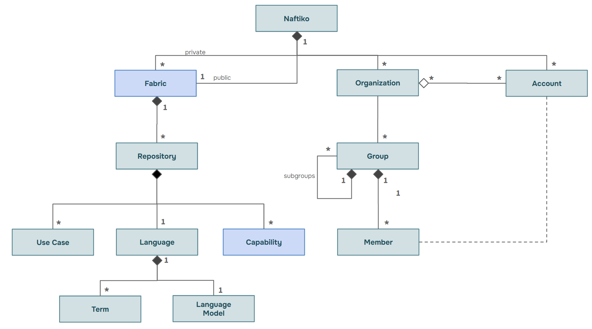
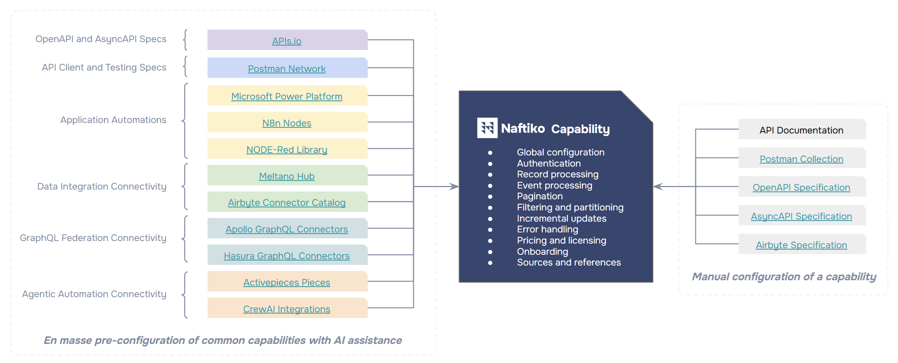

# Schema
These are the schemas guiding the product, go-to-market, and revenue work at Naftiko.

<<<<<<< HEAD
## Philosophy
We are taking a GitOps and schema-driven approach to guide work with these principles:
=======
## Fabric Metamodel
This is the metamodel being defined as part of the core product, and available in the [technology plan deck](https://docs.google.com/presentation/d/1zYfV1_xh7PuO3-7lcxrM-ps-lPdEDuGdOyYDu0rIFP0/edit?slide=id.g360f05e73a5_0_0#slide=id.g360f05e73a5_0_0).

## Capabilities Metamodel
This is the domain metamodel being define as part of the core product, and available in the [technology plan deck](https://docs.google.com/presentation/d/1zYfV1_xh7PuO3-7lcxrM-ps-lPdEDuGdOyYDu0rIFP0/edit?slide=id.g360f05e73a5_0_0#slide=id.g360f05e73a5_0_0).

There will be multiple ways to create this metamodel, direct edition in YAML, visual edition via the Naftiko Fabric visual interface and import from various related specifications as illustrated below:

>>>>>>> main

- **Schema-First** - All entities used in code and content have a supporting JSON Schema.
- **Contract-First** - Schemas are iterated upon with participation across ALL stakeholders.
- **Design-First** - Access to data is designed using OpenAPI before developing interfaces.
- **GitOps** - Utilizing YAML within Git repos to manage all work on schema contracts.

This is how we stay on the same page across many stakeholders and understand dependencies.

## Mono Repo
We are taking a mono repo strategy with each schema being defined within a single folder.

### Core Schemas
These are the schemas used at the core of Naftiko, which will be used across operations.

- **Capability** - The schema, examples, and other artifacts to support a capability.
- **Engine** - The schema, examples, and other artifacts to support an engine.
- **Fabric** - The schema, examples, and other artifacts to support the fabric.

We will keep adding to this list of core schemas, but also eventually additional schemas.

## Standards
This work intentionally focuses on using only Git and a handful of standards.

- **YAML** - Used to serialize the properties of data into a human-readable format.
- **JSON Schema** - Used to define and validate all objects used across operations.
- **OpenAPI** - Used to describe the surface area of HTTP APIs accessing data.
- **AsyncAPI** - Used to describe the surface area of TCP APIs accessing data.

We will add new standards here as they are added to the repo to support ongoing work.

## Contribute
Feel free to contribute to this work in the following ways that leverage GitHub.

- **Pull Request** - Create a new branch of the repository and submit changes as a pull request.
- **Issues** - Submit an issue asking questions, sharing research—it is a general inbox.

The goal is to keep this work simple while tackling complex work through collaboration.